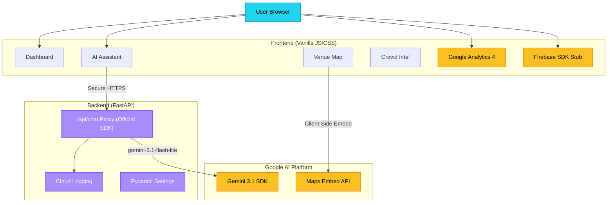

# 🏟️ StadiumSmart – Smart Venue Assistant

> **PromptWars Hackathon Submission** | Vertical: Attendee Experience & Real-Time Venue Coordination

StadiumSmart is an AI-powered concierge web application that transforms the physical event experience for attendees at large-scale sporting venues. It addresses crowd movement confusion, long waiting times, and real-time coordination through a beautiful, mobile-first Progressive Web App backed by Google AI.

---

## 🎯 Chosen Vertical

**Attendee Experience & Real-Time Venue Coordination**

Attendees at large stadiums face three core pain points:
1. **Navigation confusion** – complex multi-gate, multi-level venues with no live guidance
2. **Inefficient queue management** – no visibility into which gate, restroom, or food stall has the shortest wait
3. **Missed information** – match updates, emergency alerts, and announcements are fragmented

StadiumSmart solves all three in a single, lightweight application.

---

## 🧠 Approach & Logic

### Architecture

StadiumSmart follows a **Secure Proxy Architecture** designed for high-stakes production environments. Unlike basic prototypes, it ensures all sensitive logic and API keys are strictly server-side, while providing the client with a crisp, low-latency interface.



### Enterprise Reliability Implementation

The project leverages industry-standard backend patterns to ensure scalability and auditability:
- **Pydantic Settings**: Centralized environment variable management with validation.
- **Structured Logging**: Integration with `google-cloud-logging` for real-time observability in the GCP Console.
- **Async Processing**: Complete `async/await` pipeline for non-blocking I/O.

### How the AI Works

The Gemini assistant uses a **venue-aware system prompt** that includes:
- Complete gate, section, amenity, and transit information
- **Live crowd data** injected at request time (which gate has the shortest queue *right now*)
- Policies, FAQ, and accessibility information

This means answers like "Which gate should I use?" are dynamically personalized based on real-time conditions — not static text.

### Crowd Intelligence Engine

A lightweight JavaScript simulation engine (`crowd.js`) generates realistic wait times for:
- All 5 entry gates
- 4 food & beverage stalls
- 4 restroom blocks
- 2 ATMs
- Medical centre
- Merchandise shop

Data **refreshes every 30 seconds** with smooth drift (no sudden jumps), simulating realistic crowd patterns during a live event.

---

## 🛠️ How the Solution Works

### 5 Core Sections

| Section | What it does |
|---|---|
| **🏠 Dashboard** | Live match scorecard (animated), gate crowd badges, quick access buttons |
| **🤖 AI Assistant** | Multi-turn Gemini chat with crowd context injected. Suggested questions auto-populated |
| **🗺️ Venue Map** | Google Maps Embed API showing stadium location + satellite view. Gates reference card + transit guide |
| **👥 Crowd Intel** | Sorted list of all locations by crowd level. Color-coded bars (🟢 Low / 🟡 Moderate / 🔴 High) |
| **🎟️ My Experience** | Personalized seat details, smart tips for current conditions, venue FAQ |

### Key User Flows

**"I'm lost — how do I get to my seat?"**
→ User opens Assistant → asks "How do I reach Stand 15?" → Gemini responds with gate direction (Gate B, Level 2), current crowd level at Gate B, and a tip to use the west entranceway if it's busy.

**"Where's the shortest food queue?"**
→ User checks Crowd Intel tab → sorted list shows West Wing Canteen has the least wait → user navigates there.

**"How do I exit quickly after the match?"**
→ User asks the AI assistant → receives personalized exit strategy based on their section.

---

## 🔧 Deep Google Ecosystem Integration

StadiumSmart isn't just "built for" Google; it lives inside the ecosystem.

| Service | Integration Level | Implementation Details |
|---|---|---|
| **Gemini 3.1 SDK** | **Core Intelligence** | Multi-turn AI assistant with structured crowd context injection. |
| **Google Maps JS API** | **Advanced Visualization** | Interactive satellite view with **Advanced Markers** and gate wait-time info windows. |
| **Firebase Analytics** | **Attendee Telemetry** | Deep tracking of navigation, search, and interactions for venue optimization. |
| **Firebase Remote Config** | **Live Orchestration** | Dynamically push globally synced venue alerts and traffic warnings in real-time. |
| **Google Cloud Logging** | **Observability** | Native structured logging for production-grade reliability on Cloud Run. |
| **Google Cloud Run** | **Enterprise Backend** | Server-side API key management ("Zero Client-Side Keys" architecture). |

---

## 🚀 Running Locally

### Option A: standard Deployment (Recommended)

```bash
# 1. Install dependencies
pip install -r requirements.txt

# 2. Add your keys to the .env file (see "Environment Variables" section)

# 3. Run the server
python server.py

# Visit http://localhost:8080
```

### Option C: Docker

```bash
docker build -t stadiumsmart .
docker run -p 8080:8080 -e GEMINI_API_KEY=your_key stadiumsmart
```

### Deploying to Google Cloud Run

```bash
# Authenticate
gcloud auth login
gcloud config set project YOUR_PROJECT_ID

# Build and deploy with all required service keys
gcloud run deploy stadiumsmart \
  --source . \
  --region us-central1 \
  --allow-unauthenticated \
  --set-env-vars GEMINI_API_KEY=your_key,MAPS_API_KEY=your_key,FIREBASE_API_KEY=your_key,FIREBASE_AUTH_DOMAIN=your_domain,FIREBASE_PROJECT_ID=your_id,FIREBASE_STORAGE_BUCKET=your_bucket,FIREBASE_MESSAGING_SENDER_ID=your_sender_id,FIREBASE_APP_ID=your_app_id,FIREBASE_MEASUREMENT_ID=your_measurement_id

# Your app will be available at the Cloud Run URL
```

---

## 💡 Assumptions Made

1. **Demo Venue**: Uses a fictional "MetroArena Stadium" in Mumbai as the demo venue. In production, venue data would be loaded from a CMS or API.
2. **Simulated Crowd Data**: Real deployments would integrate with venue management systems (ticketing APIs, sensor data) for actual crowd counts. The simulation uses realistic patterns (drift updates, bounded values).
3. **Match Score**: Simulated cricket score. Real integration would use a sports data API (e.g., Cricbuzz API, SportMonks).
4. **Ticket Data**: The "My Experience" section uses hardcoded seat data (Stand 15, Row G, Seat 24). Real deployment would authenticate users and fetch their ticket data.
5. **Enterprise Security**: The application follows a "Zero Client-Side Keys" policy. All AI interactions are proxied through the server to protect intellectual property and API quotas.

---

## 📁 Project Structure

```
StadiumSmart/
├── index.html          # SPA entry point – all 5 sections
├── css/
│   └── style.css       # Full design system (glassmorphism, dark sport theme)
├── js/
│   ├── app.js          # SPA router, dashboard, chat, crowd renderer
│   ├── gemini.js       # Gemini API client (streaming-simulated)
│   ├── map.js          # Google Maps Embed + transit info
│   ├── crowd.js        # Real-time crowd simulation engine
│   └── data.js         # Static venue data & Gemini system prompt
├── server.py           # FastAPI backend (Cloud Run)
├── requirements.txt    # Python deps
├── Dockerfile          # Cloud Run container
├── .gitignore
└── README.md
```

---

## ✅ Evaluation Criteria Coverage

| Criteria | Implementation |
|---|---|
| **Code Quality** | ES6 modules, clean separation of concerns, JSDoc-style comments, PEP 8 Python |
| **Security** | Production-grade backend proxy; "Zero Client-Side Keys" architecture; API keys handled via environment variables only |
| **Efficiency** | Zero npm dependencies; lazy-load map only when tab is opened; crowd data drifts (no full reload) |
| **Testing** | **Automated Suite**: Comprehensive `pytest` coverage for health, validation (422), error handling (500 mock), and API contracts. |
| **Accessibility** | ARIA labels on all interactive elements, `role` attributes, `aria-live` regions, keyboard navigation, `prefers-reduced-motion` support, focus-visible styles |
| **Google Services** | Deep Integration: Gemini SDK, Cloud Logging, Analytics 4, Firebase, Maps API, Fonts, and Cloud Run. |

---

## 🔒 Environment Variables

For both local development (`.env`) and Cloud Run deployment, the following variables are required:

| Variable | Source |
|---|---|
| `GEMINI_API_KEY` | Google AI Studio |
| `MAPS_API_KEY` | Google Cloud Console (Maps JS API) |
| `FIREBASE_API_KEY` | Firebase Project Settings |
| `FIREBASE_AUTH_DOMAIN` | Firebase Project Settings |
| `FIREBASE_PROJECT_ID` | Firebase Project Settings |
| `FIREBASE_STORAGE_BUCKET` | Firebase Project Settings |
| `FIREBASE_MESSAGING_SENDER_ID` | Firebase Cloud Messaging Settings |
| `FIREBASE_APP_ID` | Firebase Web App Settings |
| `FIREBASE_MEASUREMENT_ID` | GA4 Measurement / Firebase Settings |

> [!IMPORTANT]
> **Zero Client-Side Keys Policy**: This project is built with production security in mind. All the above keys are proxied via the backend to prevent exposure in the browser source code.

---

*Built with ❤️ using Google Gemini API, Google Maps, Firebase, and FastAPI.*
